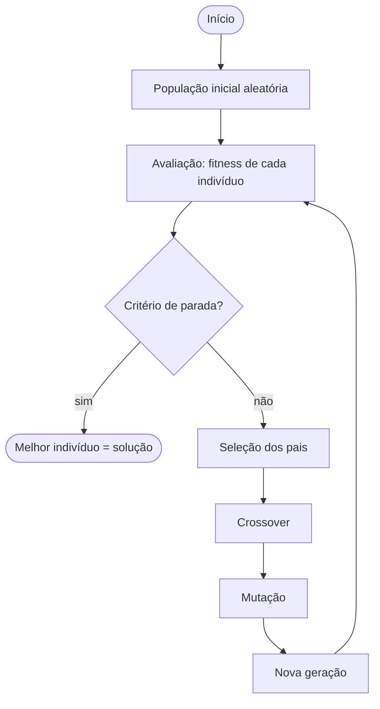

# Algoritmo Genético (GA)

**STT5900 — Análise de Dados Multivariados** · Departamento de Engenharia de Transportes · EESC/USP
Prof. André Luiz Cunha

> *A seleção natural preserva os indivíduos mais adaptados ao meio ambiente, durante várias gerações.*
> — Charles Darwin

| Arquivo | Conteúdo |
|---|---|
| [`README.md`](README.md) | Teoria da aula (este arquivo) |
| [`pratica.md`](pratica.md) | **Aula prática passo a passo**, com os códigos para copiar e colar |
| [`GA-aula.R`](GA-aula.R) | O mesmo código da prática, em um único script R |
| [`GA-slides.pptx`](GA-slides.pptx) | Slides da aula |

---

## Sumário

1. [O problema de escolher](#1-o-problema-de-escolher)
2. [GA no mundo real](#2-ga-no-mundo-real)
3. [Muitos picos, um só topo](#3-muitos-picos-um-só-topo)
4. [O que é um algoritmo genético](#4-o-que-é-um-algoritmo-genético)
5. [Elementos: gene, cromossomo, população](#5-elementos-gene-cromossomo-população)
6. [Representação](#6-representação)
7. [Operadores](#7-operadores)
8. [Parâmetros do GA no R](#8-parâmetros-do-ga-no-r)
9. [Quando usar o GA](#9-quando-usar-o-ga)
10. [Checklist antes de confiar no resultado](#10-checklist-antes-de-confiar-no-resultado)
11. [Prática e desafio](#11-prática-e-desafio)
12. [Material de apoio](#12-material-de-apoio)

---

## 1. O problema de escolher

Quais variáveis devem entrar em um modelo? Cada uma **entra ou fica fora**. Com $n$ variáveis candidatas, existem $2^n - 1$ modelos possíveis:

| Variáveis | Modelos possíveis | Testando tudo, a 1 ms por modelo |
|---:|---:|---|
| 10 | 1.023 | 1 segundo |
| 20 | ~1 milhão | 17 minutos |
| 40 | ~1,1 trilhão | **35 anos** |

Na Parte 4 da prática, o GA encontra a **melhor** combinação de 10 variáveis do `mtcars` avaliando só **~150 das 1.023** (cerca de 15%). A força bruta confirma que é o ótimo.

> Não dá para testar tudo. Dá para **evoluir**.

## 2. GA no mundo real

| Aplicação | O que o GA faz |
|---|---|
| **Antena da NASA (ST5, 2006)** | Um algoritmo evolutivo projetou a antena dos satélites Space Technology 5. O formato é "estranho", o desempenho atendeu aos requisitos da missão e a antena voou no espaço ([Hornby et al., 2006](https://ntrs.nasa.gov/citations/20060024675)). |
| **Tempos semafóricos** | O TRANSYT-7F otimiza ciclo, sequência de fases, tempos de verde e defasagens por GA ([TRANSYT-7F](https://en.wikipedia.org/wiki/TRANSYT-7F)). |
| **Calibração de simuladores** | Ajustar os parâmetros do VISSIM ou do SUMO para reproduzir velocidades e filas observadas. O simulador é uma caixa-preta: não há derivadas. |
| **Rotas e logística** | Roteirização de veículos e coleta: o cromossomo é a **ordem** de visita (representação por permutação). |

## 3. Muitos picos, um só topo


$$f(x) = \sin x + \sin 3x \cdot \cos x, \qquad -5 \le x \le 5$$

- Otimizadores clássicos (gradiente, Newton, L-BFGS) **sobem a ladeira mais próxima** e param no primeiro topo.
- O resultado depende de **onde se começa**. Na figura, quem parte de $x = -1{,}5$ para num "pico" com $f < 0$.
- O GA espalha uma **população** pelo domínio e deixa a seleção escolher a montanha.

É a função da [Parte 1 da prática](pratica.md#parte-1--aquecimento-1d).

## 4. O que é um algoritmo genético

O GA é um **algoritmo de busca estocástico inspirado na evolução biológica**. Pertence à área da **Computação Evolutiva** [Strucca, 2022], que:

- simula a evolução de organismos vivos;
- imita os mecanismos biológicos de **seleção, crossover e mutação**;
- usa esses mecanismos para **otimizar** funções e modelos.

### O ciclo



Cada volta do ciclo é uma **geração**. A população vai se concentrando nas regiões de maior fitness, mas a mutação mantém alguma diversidade para não estagnar num pico local.

## 5. Elementos: gene, cromossomo, população

| Biologia | GA | Exemplo: calibrar Greenshields |
|---|---|---|
| **Gene** | uma característica do problema, geralmente uma variável | $u_f$ ou $k_j$ |
| **Cromossomo** | sequência de genes = um indivíduo = **uma solução candidata** | $(u_f, k_j) = (110;\ 85)$ |
| **População** | grupo de indivíduos avaliados ao mesmo tempo | 50 pares $(u_f, k_j)$ |
| **Adaptação** | valor da função **fitness** | $-\text{RMSE}$ da velocidade |
| **Geração** | uma iteração do ciclo | `maxiter = 300` |

```
        gene
         ↓
A1  [1 0 0 1 1 0]   ← cromossomo (indivíduo)
A2  [0 0 1 1 1 0]
A3  [0 1 0 1 0 0]   ← população = A1..A4
A4  [0 1 1 0 0 1]
```

## 6. Representação

| Tipo | Cromossomo | Uso | No R |
|---|---|---|---|
| **Binária** | $[1110101 \mid 1001 \mid \cdots \mid 10101]$ | versão clássica; escolhas sim/não. Para variáveis contínuas pode ser lenta | `type = "binary"` |
| **Real** | $[11 \mid 32 \mid 5 \mid \cdots \mid 10]$ | cada gene é seu próprio valor real; versão atual para parâmetros contínuos | `type = "real-valued"` |
| **Permutação** | $[1 \mid 2 \mid 5 \mid 7 \mid \cdots \mid 10]$ | cada gene tem valor único; problemas de ordem, combinação e roteamento | `type = "permutation"` |

## 7. Operadores

### 7.1 Avaliação: a função fitness

A **fitness** mede o nível de adaptação do indivíduo. Em geral é a própria função que se quer otimizar.

> ⚠️ O pacote `GA` **sempre maximiza**. Para **minimizar** um erro, devolva o erro com sinal negativo:
> $$\text{fitness}(\theta) = -\text{RMSE}(\theta) = -\sqrt{\frac{1}{n}\sum_{i=1}^{n}\big(y_i - \hat y_i(\theta)\big)^2}$$

Às vezes a fitness é transformada para um intervalo fixo, como $[0; 1]$:

| Logística | Tangente hiperbólica |
|---|---|
| $f(\vec x) = \dfrac{1}{1 + e^{-\beta x}}$ | $f(\vec x) = \dfrac{1 - e^{-\beta x}}{1 + e^{-\beta x}}$ |

### 7.2 Seleção

Os melhores indivíduos são mantidos e se tornam os **pais** da próxima geração. Estratégias comuns:

- **Ordenação:** ordena por adaptação e combina pais pares com ímpares.
- **Aleatória:** todos têm a mesma chance de ser pai.
- **Roleta:** a chance de ser escolhido é proporcional à fitness (a "fatia" da roleta).
- **Torneio:** sorteia um pequeno grupo e o melhor do grupo vence.

**Elitismo:** os melhores indivíduos passam intactos para a geração seguinte, o que garante que a melhor solução nunca piora (`elitism` no R).

### 7.3 Crossover

Cruzamento de dois pais para gerar filhos.

```
Ponto único                      Múltiplos pontos
pai 1  1 0 1 | 0 1 1             pai 1  1 0 | 1 0 | 1 1
pai 2  1 1 0 | 1 1 0             pai 2  1 1 | 0 1 | 1 0
filho  1 0 1 | 1 1 0             filho  1 0 | 0 1 | 1 1
```

Também existe a **máscara de seleção**: um vetor de bits diz, gene a gene, de qual pai o filho herda.

### 7.4 Mutação

De tempos em tempos, alguns indivíduos sofrem alterações aleatórias em um ou mais genes. A mutação **mantém a diversidade** e permite escapar de picos locais.

```
antes   1 0 1 1 1 0
depois  1 0 0 1 1 0
            ↑
```

### 7.5 Predação (opcional)

Uma "catástrofe" que elimina parte da população de tempos em tempos: os menos adaptados são substituídos por indivíduos novos e aleatórios. Ajuda quando a população fica homogênea demais.

## 8. Parâmetros do GA no R

Pacote [`GA`](https://luca-scr.github.io/GA/) (Scrucca, 2013):

```r
ga(type     = "real-valued",   # "binary" | "real-valued" | "permutation"
   fitness  = funcao,          # sempre MAXIMIZADA
   lower    = c(a = 0, b = 0), # limites inferiores (nomes viram rótulos)
   upper    = c(a = 1, b = 9), # limites superiores
   popSize  = 50,              # tamanho da população
   maxiter  = 100,             # nº máximo de gerações
   run      = 50,              # para se não melhorar em 'run' gerações
   pcrossover = 0.8,           # probabilidade de crossover
   pmutation  = 0.1,           # probabilidade de mutação
   elitism  = 2,               # quantos melhores passam intactos
   optim    = TRUE,            # GA híbrido: refinamento local no fim
   parallel = FALSE,           # TRUE divide a população entre os núcleos
   monitor  = TRUE,            # acompanhar a evolução
   seed     = 123)             # reprodutibilidade
```

| Parâmetro | Aumentar | Diminuir |
|---|---|---|
| `popSize` | explora mais, mais lento | rápido, pode convergir no pico errado |
| `pmutation` | mais diversidade, convergência "agitada" | converge rápido, risco de estagnar |
| `maxiter` / `run` | mais chances de melhorar | para mais cedo |
| `optim = TRUE` | o GA acha a montanha, o otimizador local acha o topo | — |

## 9. Quando usar o GA

| ✅ Use o GA quando… | ❌ Prefira outro método quando… |
|---|---|
| a função tem **muitos picos** | existe **solução fechada** (ex.: mínimos quadrados) |
| não há derivada ou o modelo é uma **caixa-preta** (simulador) | a função é **suave e tem um só ótimo** |
| as variáveis são **discretas**: sim/não, ordens, rotas | cada avaliação é **caríssima** e não há como paralelizar |
| as restrições são difíceis de escrever | |

> **Boa prática:** teste o GA num problema com resposta conhecida. Na Parte 2 da prática, ele reproduz o `lm()` até a 4ª casa decimal.

## 10. Checklist antes de confiar no resultado

- [ ] Rodei com **outra semente** e cheguei perto do mesmo lugar?
- [ ] A solução está **longe dos limites** `lower`/`upper`? Se encostou, alargue o intervalo.
- [ ] O `plot()` do GA mostra a **fitness estabilizada**?
- [ ] Avaliei **fora da amostra** de calibração (teste ou validação cruzada)?

## 11. Prática e desafio

👉 **[Abrir a aula prática (`pratica.md`)](pratica.md)**

| Parte | Tema | Ferramentas |
|---|---|---|
| 1 | Aquecimento 1D: GA × `optim()` | `ga()`, `monitor` |
| 2 | Regressão por GA (`mtcars`) conferida com `lm()` | `recipe()`, `step_normalize()` |
| 3 | Calibração de Greenshields e Van Aerde (SP-270 km 27) | `initial_split()`, `metric_set()` |
| 4 | GA binário: seleção de variáveis com validação cruzada | `vfold_cv()`, `fit_resamples()` |

### 🏆 Desafio: quem chega mais longe?

1. **Van Aerde na SP-270:** menor RMSE no conjunto de teste vence. Mesma semente do split para todos.
2. **Força bruta:** avalie as 1.023 combinações da Parte 4 com `system.time()`. Quanto tempo o GA economizou?
3. **Bônus:** `type = "permutation"`: a menor rota que passa por 8 praças de pedágio (caixeiro-viajante).

## 12. Material de apoio

- [GA — R package (CRAN)](https://cran.r-project.org/web/packages/GA/vignettes/GA.html)
- [A quick tour of GA](http://luca-scr.github.io/GA/articles/GA.html)
- [Feature Selection using Genetic Algorithms in R](https://blog.datascienceheroes.com/feature-selection-using-genetic-algorithms-in-r/)
- [Optimization with Genetic Algorithm (RPubs)](https://rpubs.com/Argaadya/550805)
- [Introduction to Genetic Algorithm & their application in data science](https://www.analyticsvidhya.com/blog/2017/07/introduction-to-genetic-algorithm/)
- [Learn Genetic Algorithm — absolute beginners](https://www.tutorialspoint.com/genetic_algorithms/index.htm)
- Carvalho et al. (2021). *Inteligência Artificial — Uma Abordagem de Aprendizado de Máquina*. LTC, 2ª ed.
- Scrucca, L. (2013). GA: A Package for Genetic Algorithms in R. *Journal of Statistical Software*, 53(4).
- Hornby, G. S. et al. (2006). [Automated Antenna Design with Evolutionary Algorithms](https://ntrs.nasa.gov/citations/20060024675). AIAA Space 2006.
- Van Aerde, M. (1995). Single regime speed-flow-density relationship for congested and uncongested highways. *74th TRB Annual Meeting*.
