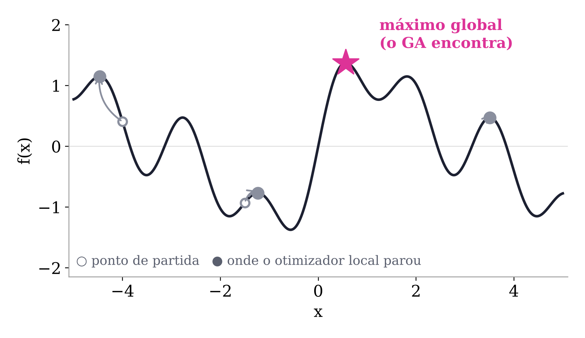

# Aula prática: Algoritmo Genético em R

**STT5900 — Análise de Dados Multivariados** · EESC/USP · Prof. André Luiz Cunha

← [Voltar para a teoria (`README.md`)](README.md) · Script completo: [`GA-aula.R`](GA-aula.R)

Copie e cole cada bloco no console do R, **na ordem**. As saídas mostradas foram obtidas com `GA 3.2.5` e `tidymodels 1.1.1`. Os seus números podem variar um pouco com a versão dos pacotes: compare com o colega ao lado.

---

## Sumário

- [Preparação](#preparação)
- [Onde o tidymodels entra (e onde não entra)](#onde-o-tidymodels-entra-e-onde-não-entra)
- [Parte 1 — Aquecimento 1D](#parte-1--aquecimento-1d)
- [Ferramenta: um calibrador genérico](#ferramenta-um-calibrador-genérico)
- [Parte 2 — Regressão por GA (`mtcars`)](#parte-2--regressão-por-ga-mtcars)
- [Parte 3 — Calibração de modelos de tráfego (SP-270 km 27)](#parte-3--calibração-de-modelos-de-tráfego-sp-270-km-27)
- [Parte 4 — GA binário: seleção de variáveis](#parte-4--ga-binário-seleção-de-variáveis)
- [Resumo](#resumo)

---

## Preparação

Instale os pacotes **antes da aula** (o `tidymodels` traz mais de 80 dependências):

```r
install.packages(c("GA", "tidymodels", "readxl"))
```

Carregue os pacotes e fixe a semente usada em toda a aula:

```r
library(GA)
library(tidymodels)
tidymodels_prefer()     # resolve conflitos de nomes (filter, select, ...)

SEMENTE <- 123456
```

Para a Parte 3, deixe o arquivo `sp270km27.xlsx` na **pasta de trabalho** do R (`getwd()`). Sem ele, o código usa dados sintéticos só para rodar.

## Onde o tidymodels entra (e onde não entra)

O tidymodels **não tem um GA próprio**: quem otimiza continua sendo `GA::ga()`. O ganho está em tudo que fica **em volta** da otimização:

| Tarefa | Antes (aula 2025) | Agora |
|---|---|---|
| Escala das variáveis | nenhuma (limites ±100) | `recipe()` + `step_normalize()` |
| Erro da função fitness | `sum((obs - mod)^2)` | `yardstick::rmse_vec()` |
| Conferir o resultado | olhar os números | `linear_reg()` + `tidy()` |
| Avaliar fora da amostra | — | `initial_split()` / `testing()` |
| Métricas | — | `metric_set(rmse, mae, rsq)` |
| Seleção de variáveis | — | `vfold_cv()` + `fit_resamples()` |

Para curvas simples (Greenshields, Van Aerde), o GA com uma função de previsão vetorizada é o caminho mais curto. O tidymodels brilha na **Parte 4**, quando cada avaliação da fitness é, ela mesma, um modelo validado.

---

## Parte 1 — Aquecimento 1D

Uma função com **vários picos**. Qual é o maior entre −5 e 5?

$$f(x) = \sin x + \sin 3x \cdot \cos x$$

```r
f <- function(x) sin(x) + sin(3 * x) * cos(x)
lbound <- -5
ubound <-  5
curve(f, lbound, ubound, n = 500, lwd = 2)
```



### 1.1 O otimizador clássico depende de onde começa

`optim()` sobe a ladeira mais próxima e para no primeiro topo que encontra. Vamos largar de quatro pontos diferentes:

```r
inicios <- c(-4, -1.5, 0.5, 3.5)

tibble(inicio = inicios) |>
  mutate(
    x_final = map_dbl(inicio, \(x0) optim(x0, f, method = "L-BFGS-B",
                                          lower = lbound, upper = ubound,
                                          control = list(fnscale = -1))$par),
    f_final = f(x_final)
  )
```

```
# A tibble: 4 × 3
  inicio x_final f_final
   <dbl>   <dbl>   <dbl>
1   -4    -4.47    1.15
2   -1.5  -1.24   -0.768
3    0.5   0.565   1.37
4    3.5   3.51    0.473
```

> 💡 Só quem parte perto de $x = 0{,}56$ acha o máximo global ($f = 1{,}37$). Quem parte de $-1{,}5$ para num "pico" **negativo**. Na vida real você não sabe de antemão onde começar.

### 1.2 O GA olha para uma população inteira

```r
GA <- ga(type    = "real-valued",
         fitness = f,                 # o GA sempre MAXIMIZA
         lower   = c(x = lbound),
         upper   = c(x = ubound),
         seed    = SEMENTE)

summary(GA)
```

```
-- Genetic Algorithm -------------------

GA settings:
Type                  =  real-valued
Population size       =  50
Number of generations =  100
Elitism               =  2
Crossover probability =  0.8
Mutation probability  =  0.1
Search domain =
       x
lower -5
upper  5

GA results:
Iterations             = 100
Fitness function value = 1.373498
Solution =
             x
[1,] 0.5649277
```

O máximo global, **sem escolher ponto de partida**. Marque a solução no gráfico:

```r
curve(f, lbound, ubound, n = 500, lwd = 2)
points(GA@solution, GA@fitnessValue, col = "red", pch = 19, cex = 1.5)
```

### 1.3 Assistir à evolução, geração a geração

A função `monitor` é chamada a cada geração e redesenha a população sobre a curva:

```r
monitor <- function(obj) {
  curve(f, lbound, ubound, n = 500,
        main = paste("geração =", obj@iter))
  points(obj@population, obj@fitness, pch = 20, col = 2)
  rug(obj@population, col = 2)
  Sys.sleep(0.2)
}

GA <- ga(type = "real-valued", fitness = f,
         lower = c(x = lbound), upper = c(x = ubound),
         popSize = 20, maxiter = 30,
         monitor = monitor, seed = SEMENTE)
```

> 🔧 **Para mexer**
> - `popSize = 5`: população pequena, às vezes converge no pico errado.
> - `pmutation = 0.5`: muita mutação, a população "não sossega".
> - `optim = TRUE`: GA híbrido, o GA acha a montanha e o `optim()` acha o topo.

---

## Ferramenta: um calibrador genérico

Usado nas Partes 2 e 3. Em vez de reescrever a fitness para cada modelo, escrevemos **uma vez**:

- `prever(p)`: devolve as previsões do modelo para o vetor de parâmetros `p`;
- `y`: os valores observados.

A fitness é $-\text{RMSE}$: mesmo ótimo que $-\text{SQE}$, mas na **unidade de y**, fácil de ler.

```r
calibrar_ga <- function(prever, y, lower, upper,
                        popSize = 50, maxiter = 300, run = 50,
                        seed = SEMENTE, ...) {
  fitness <- function(p) {
    names(p) <- names(lower)
    pred <- prever(p)
    if (any(!is.finite(pred))) return(-1e10)   # parâmetro inválido = péssimo
    -rmse_vec(truth = y, estimate = pred)
  }
  ga(type = "real-valued", fitness = fitness,
     lower = lower, upper = upper,
     popSize = popSize,
     maxiter = maxiter,
     run     = run,      # para se a melhor solução não melhorar em 'run' gerações
     optim   = TRUE,     # refinamento local no fim (GA híbrido)
     monitor = FALSE,
     seed    = seed, ...)
}
```

Uma solução **colada no limite** indica limite mal escolhido. Esta função avisa:

```r
conferir_limites <- function(modelo_ga, lower, upper, tol = 0.01) {
  s <- modelo_ga@solution[1, ]
  tibble(parametro = names(lower),
         estimado  = s,
         inferior  = lower,
         superior  = upper) |>
    mutate(alerta = if_else(estimado - inferior < tol * (superior - inferior) |
                              superior - estimado < tol * (superior - inferior),
                            "<< no limite: alargue o intervalo", ""))
}
```

---

## Parte 2 — Regressão por GA (`mtcars`)

Modelo: `qsec` (tempo, em segundos, no 1/4 de milha) em função de `mpg + hp + wt`.

A regressão linear tem **solução exata** (mínimos quadrados). Por isso é o exemplo perfeito para **conferir** o GA antes de usá-lo onde não há fórmula.

### 2.1 Recipe: padronizar os preditores

`hp` vai até 335; `wt`, até 5,4. Sem padronizar, os coeficientes vivem em escalas muito diferentes e o GA precisa de limites enormes (±100). Com `step_normalize()`, todos os preditores ficam com média 0 e desvio 1.

```r
receita <- recipe(qsec ~ mpg + hp + wt, data = mtcars) |>
  step_normalize(all_numeric_predictors())

carros <- bake(prep(receita), new_data = NULL)
carros |> head(3)
```

```
# A tibble: 3 × 4
    mpg     hp     wt  qsec
  <dbl>  <dbl>  <dbl> <dbl>
1 0.151 -0.535 -0.610  16.5
2 0.151 -0.535 -0.350  17.0
3 0.450 -0.783 -0.917  18.6
```

### 2.2 A previsão, vetorizada

Antes: `w[1] + w[2]*mpg + w[3]*hp + w[4]*wt`, uma parcela por variável.
Agora: produto matricial $\hat y = X\,w$, que serve para 3 ou para 30 variáveis.

```r
X <- model.matrix(qsec ~ mpg + hp + wt, data = carros)   # inclui o intercepto
prever_linear <- function(w) drop(X %*% w)
```

### 2.3 GA

```r
lim_inf <- c(b0 = 10, mpg = -5, hp = -5, wt = -5)
lim_sup <- c(b0 = 25, mpg =  5, hp =  5, wt =  5)

GA1 <- calibrar_ga(prever_linear, y = carros$qsec,
                   lower = lim_inf, upper = lim_sup, popSize = 100)
summary(GA1)
plot(GA1)            # melhor, média e mediana da fitness por geração

conferir_limites(GA1, lim_inf, lim_sup)
```

```
GA results:
Iterations             = 80
Fitness function value = -1.013312
Solution =
           b0       mpg        hp      wt
[1,] 17.84875 0.5437036 -1.675904 1.26354
```

### 2.4 Conferência: GA × mínimos quadrados

```r
mq <- linear_reg() |> fit(qsec ~ mpg + hp + wt, data = carros)

tidy(mq) |>
  select(termo = term, minimos_quadrados = estimate) |>
  mutate(ga = as.numeric(GA1@solution[1, ]),
         diferenca = round(ga - minimos_quadrados, 4))
```

```
# A tibble: 4 × 4
  termo       minimos_quadrados     ga diferenca
  <chr>                   <dbl>  <dbl>     <dbl>
1 (Intercept)            17.8   17.8           0
2 mpg                     0.544  0.544         0
3 hp                     -1.68  -1.68          0
4 wt                      1.26   1.26          0
```

> ✅ O GA chegou ao mesmo resultado **sem derivadas e sem fórmula**.

> 🔧 **Para mexer:** tire o `step_normalize()` e use limites ±100, como na versão antiga. Compare o `plot(GA1)` nos dois casos: quantas gerações até estabilizar?

---

## Parte 3 — Calibração de modelos de tráfego (SP-270 km 27)

Relação fundamental do tráfego:

$$q = u \cdot k$$

| Símbolo | Variável | Unidade | Coluna |
|---|---|---|---|
| $q$ | fluxo | veic/h | `Volume_vph` |
| $u$ | velocidade | km/h | `Velocidade_kmph` |
| $k$ | densidade | veic/km | `Densidade_vpkm` |

### 3.1 Dados

```r
arquivo <- "sp270km27.xlsx"   # deixe o arquivo na pasta de trabalho

if (file.exists(arquivo)) {
  dados <- readxl::read_excel(arquivo) |>
    select(Volume_vph, Velocidade_kmph, Densidade_vpkm) |>
    drop_na()
} else {
  # Plano B: dados SINTÉTICOS só para o código rodar sem o arquivo.
  # (Van Aerde com uf = 110, uc = 80, kj = 150, qc = 2200, mais ruído)
  warning("sp270km27.xlsx não encontrado: usando dados SINTÉTICOS de teste.")
  set.seed(SEMENTE)
  dados <- tibble(Velocidade_kmph = runif(400, 15, 105)) |>
    mutate(Densidade_vpkm = 1 / (0.005729 + 0.10313 / (110 - Velocidade_kmph) +
                                   0.00033997 * Velocidade_kmph),
           Densidade_vpkm = Densidade_vpkm * exp(rnorm(n(), 0, 0.08)),
           Volume_vph     = Velocidade_kmph * Densidade_vpkm)
}

ggplot(dados, aes(Densidade_vpkm, Velocidade_kmph)) +
  geom_point(alpha = 0.4) +
  labs(x = "Densidade (veic/km)", y = "Velocidade (km/h)",
       title = "SP-270 km 27 — diagrama velocidade × densidade") +
  theme_minimal()
```

### 3.2 Split: calibrar em uma parte, validar na outra

Calibrar e avaliar nos mesmos dados mede só o quanto o modelo **decorou** a amostra.

```r
set.seed(SEMENTE)
divisao <- initial_split(dados, prop = 0.75)
treino  <- training(divisao)
teste   <- testing(divisao)

metricas <- metric_set(rmse, mae, rsq)
```

### 3.3 Greenshields (1935)

O modelo mais simples: a velocidade cai **linearmente** com a densidade.

$$u = u_f\left(1 - \frac{k}{k_j}\right)$$

$u_f$: velocidade de fluxo livre · $k_j$: densidade de congestionamento (*jam density*)

```r
greenshields <- function(p, k) p["uf"] * (1 - k / p["kj"])

lim_gs_inf <- c(uf =  70, kj =  40)
lim_gs_sup <- c(uf = 140, kj = 300)

GA2 <- calibrar_ga(\(p) greenshields(p, treino$Densidade_vpkm),
                   y = treino$Velocidade_kmph,
                   lower = lim_gs_inf, upper = lim_gs_sup)
summary(GA2)
conferir_limites(GA2, lim_gs_inf, lim_gs_sup)
```

**Conferência.** Greenshields é uma **reta** no plano $u \times k$:

$$u = u_f - \frac{u_f}{k_j}\,k \quad\Rightarrow\quad \text{intercepto} = u_f, \qquad \text{inclinação} = -\frac{u_f}{k_j}$$

Logo, mínimos quadrados resolvem. Os dois pares devem praticamente coincidir:

```r
reta <- linear_reg() |> fit(Velocidade_kmph ~ Densidade_vpkm, data = treino) |> tidy()
c(uf_mq = reta$estimate[1],
  kj_mq = -reta$estimate[1] / reta$estimate[2],
  GA2@solution[1, ])
```

> ⚠️ **Correção da versão anterior.** O gráfico usava `abline(a = sol[1], b = -sol[2]/sol[1])`, ou seja, inclinação $-k_j/u_f$. O correto é $-u_f/k_j$.

**Validação no teste:**

```r
teste |>
  mutate(.pred = greenshields(GA2@solution[1, ], Densidade_vpkm)) |>
  metricas(truth = Velocidade_kmph, estimate = .pred)
```

| `.metric` | O que mede |
|---|---|
| `rmse` | erro típico, em km/h |
| `mae` | erro absoluto médio, em km/h |
| `rsq` | fração da variância explicada (0 a 1) |

### 3.4 Van Aerde (1995): quatro parâmetros, não linear

O modelo de Van Aerde descreve, com **um único regime**, o fluxo livre e o congestionado:

$$k(u) = \frac{1}{c_1 + \dfrac{c_2}{u_f - u} + c_3\,u}$$

$$c_1 = \frac{u_f}{k_j\,u_c^2}\,(2u_c - u_f) \qquad c_2 = \frac{u_f}{k_j\,u_c^2}\,(u_f - u_c)^2 \qquad c_3 = \frac{1}{q_c} - \frac{u_f}{k_j\,u_c^2}$$

| Parâmetro | Significado |
|---|---|
| $u_f$ | velocidade de fluxo livre (km/h) |
| $u_c$ | velocidade na capacidade (km/h) |
| $k_j$ | densidade de congestionamento (veic/km) |
| $q_c$ | capacidade (veic/h) |

Aqui **não há fórmula fechada**: é o terreno do GA.

```r
van_aerde <- function(p, u) {
  if (p["uc"] >= p["uf"]) return(rep(NA_real_, length(u)))   # sem sentido físico
  m  <- p["uf"] / (p["kj"] * p["uc"]^2)
  c1 <- m * (2 * p["uc"] - p["uf"])
  c2 <- m * (p["uf"] - p["uc"])^2
  c3 <- 1 / p["qc"] - m
  1 / (c1 + c2 / (p["uf"] - u) + c3 * u)
}

lim_va_inf <- c(uf =  80, uc = 40, kj =  40, qc = 1500)
lim_va_sup <- c(uf = 140, uc = 90, kj = 300, qc = 3000)

GA3 <- calibrar_ga(\(p) van_aerde(p, treino$Velocidade_kmph),
                   y = treino$Densidade_vpkm,
                   lower = lim_va_inf, upper = lim_va_sup)
summary(GA3)
plot(GA3)
conferir_limites(GA3, lim_va_inf, lim_va_sup)
```

> 💡 **Por que `NA` quando $u_c \ge u_f$?** Combinações sem sentido físico geram previsões inválidas. A fitness do `calibrar_ga()` transforma isso em `-1e10`, e o indivíduo é eliminado pela seleção. É assim que se impõem **restrições** num GA.

**Validação no teste:**

```r
teste |>
  mutate(.pred = van_aerde(GA3@solution[1, ], Velocidade_kmph)) |>
  metricas(truth = Densidade_vpkm, estimate = .pred)
```

> ⚠️ Greenshields prevê **velocidade** e Van Aerde prevê **densidade**. Os RMSE estão em unidades diferentes: não compare um com o outro.

### 3.5 As duas curvas sobre os dados

```r
p_gs <- GA2@solution[1, ]
p_va <- GA3@solution[1, ]

curvas <- bind_rows(
  tibble(modelo = "Greenshields",
         k = seq(0, p_gs["kj"], length.out = 200)) |>
    mutate(u = greenshields(p_gs, k)),
  tibble(modelo = "Van Aerde",
         u = seq(1, p_va["uf"] - 0.01, length.out = 400)) |>
    mutate(k = van_aerde(p_va, u))
) |>
  filter(k >= 0, k <= max(dados$Densidade_vpkm) * 1.2)

ggplot(dados, aes(Densidade_vpkm, Velocidade_kmph)) +
  geom_point(alpha = 0.3, colour = "grey40") +
  geom_path(data = curvas, aes(k, u, colour = modelo), linewidth = 1.2) +
  labs(x = "Densidade (veic/km)", y = "Velocidade (km/h)", colour = NULL,
       title = "Modelos calibrados por GA") +
  theme_minimal() +
  theme(legend.position = "top")
```

> ⚠️ **Correção da versão anterior.** O Van Aerde era desenhado com a mesma reta do Greenshields (`abline`). Como $k(u)$ é uma curva, agora geramos uma sequência de velocidades, calculamos $k$ e desenhamos o caminho.

> 🔧 **Para mexer:** estreite os limites de `kj` para 40–100 (os da versão 2025) e rode `conferir_limites()`. O alerta aparece? O que isso diz sobre os dados?

---

## Parte 4 — GA binário: seleção de variáveis

**Pergunta:** quais das 10 variáveis do `mtcars` preveem melhor o `qsec`?

Cada indivíduo é um vetor de **10 bits**: 1 = a variável entra, 0 = fica fora.

```
mpg cyl disp hp drat wt vs am gear carb
 1   0   0   1   0   1  0  0   0    0     →  qsec ~ mpg + hp + wt
```

São $2^{10} - 1 = 1.023$ combinações. Com 40 variáveis seriam ~1,1 trilhão.

```r
preditores <- setdiff(names(mtcars), "qsec")
```

### 4.1 Validação cruzada: a fitness não pode olhar só o ajuste no treino

Mais variáveis **sempre** melhoram o ajuste no treino. A validação cruzada pune variáveis que só decoram ruído.

```r
set.seed(SEMENTE)
dobras <- vfold_cv(mtcars, v = 5, repeats = 3)
```

### 4.2 Fitness = −RMSE médio na validação cruzada

**Memória (cache):** o GA repete muitos indivíduos entre gerações. Guardar o resultado de cada combinação evita refazer a validação cruzada.

```r
memoria <- new.env()

fitness_selecao <- function(bits) {
  chave <- paste(bits, collapse = "")
  if (!is.null(memoria[[chave]])) return(memoria[[chave]])
  if (sum(bits) == 0) return(-1e10)                 # modelo vazio não vale

  fluxo <- workflow() |>
    add_formula(reformulate(preditores[bits == 1], response = "qsec")) |>
    add_model(linear_reg())

  valor <- fit_resamples(fluxo, resamples = dobras,
                         metrics = metric_set(rmse)) |>
    collect_metrics() |>
    pull(mean)

  memoria[[chave]] <- -valor
  -valor
}
```

### 4.3 GA binário

Leva cerca de 30 segundos.

```r
GA4 <- ga(type    = "binary",
          fitness = fitness_selecao,
          nBits   = length(preditores),
          names   = preditores,
          popSize = 20,
          maxiter = 30,
          run     = 10,
          seed    = SEMENTE)

summary(GA4)
plot(GA4)
```

```
GA results:
Iterations             = 24
Fitness function value = -0.7477629
Solution =
     mpg cyl disp hp drat wt vs am gear carb
[1,]   0   0    1  0    0  1  1  0    0    1
```

```r
escolhidas <- preditores[GA4@solution[1, ] == 1]
escolhidas
length(ls(memoria))   # quantas combinações o GA REALMENTE avaliou
```

```
[1] "disp" "wt"   "vs"   "carb"
[1] 148
```

### 4.4 Comparar: todas as variáveis × as da aula × as escolhidas pelo GA

```r
comparar <- function(vars, rotulo) {
  workflow() |>
    add_formula(reformulate(vars, response = "qsec")) |>
    add_model(linear_reg()) |>
    fit_resamples(resamples = dobras, metrics = metric_set(rmse, rsq)) |>
    collect_metrics() |>
    mutate(modelo = rotulo, n_variaveis = length(vars))
}

bind_rows(
  comparar(preditores,           "todas as 10"),
  comparar(c("mpg", "hp", "wt"), "aula (mpg, hp, wt)"),
  comparar(escolhidas,           "escolhidas pelo GA")
) |>
  select(modelo, n_variaveis, .metric, mean) |>
  pivot_wider(names_from = .metric, values_from = mean)
```

```
# A tibble: 3 × 4
  modelo             n_variaveis  rmse   rsq
  <chr>                    <int> <dbl> <dbl>
1 todas as 10                 10 1.04  0.701
2 aula (mpg, hp, wt)           3 1.12  0.638
3 escolhidas pelo GA           4 0.748 0.839
```

> 🏆 O GA escolheu `disp + wt + vs + carb` avaliando **148 das 1.023** combinações, e a força bruta confirma que essa é a **melhor de todas**. 15% do trabalho, 100% do resultado. Com menos variáveis, o modelo erra **28% menos** na validação do que o modelo com todas.

> 🔧 **Para mexer**
> - Troque `linear_reg()` por outro modelo (ex.: `rand_forest()`). A fitness continua a mesma: é a vantagem de montá-la com `workflow()`.
> - **Desafio:** confirme por força bruta (as 1.023 combinações) e meça o tempo com `system.time()`. Agora imagine 40 variáveis.
> - Para bases maiores, `ga(..., parallel = TRUE)` divide a população entre os núcleos do computador. Vale a pena quando cada fitness é cara.

---

## Resumo

| `type` | Uso | Nesta aula |
|---|---|---|
| `"real-valued"` | parâmetros contínuos | Partes 1, 2 e 3 |
| `"binary"` | escolhas sim/não | Parte 4 |
| `"permutation"` | ordens e rotas | Desafio: caixeiro-viajante |

- O GA **sempre maximiza**: para minimizar um erro, devolva `-erro`.
- `popSize`: tamanho da população · `maxiter`: nº máximo de gerações
- `run`: parada por estagnação · `optim`: refinamento local (híbrido)
- `seed`: reprodutibilidade · `monitor`: assistir à evolução

### Checklist antes de confiar numa solução do GA

- [ ] Rodei com outra semente e cheguei perto do mesmo lugar?
- [ ] A solução não está colada nos limites? (`conferir_limites()`)
- [ ] O `plot()` mostra a fitness estabilizada?
- [ ] Avaliei fora da amostra de calibração (teste ou validação cruzada)?

← [Voltar para a teoria (`README.md`)](README.md)
